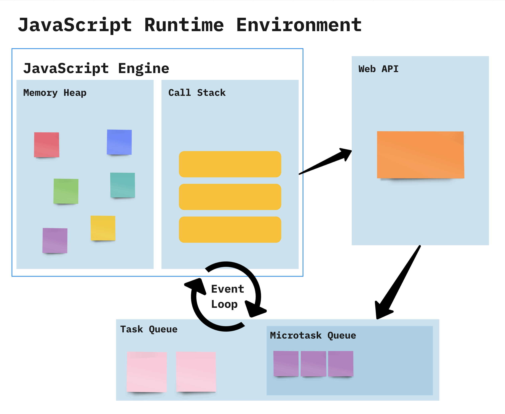

# JAVASCRIPT

The language either you will 💖 it or hate it.

[introduction to javascript in 100s](https://www.youtube.com/watch?v=DHjqpvDnNGE)

Q. why we need javascript ?

A. html and css is only capable of doing structure and styling of a webpage to make webpage interactive we need js because it is only language apart of [webassembly](https://developer.mozilla.org/en-US/docs/WebAssembly/Concepts#:~:text=WebAssembly%20is%20a%20new%20type,C%2B%2B%2C%20Rust%2C%20etc.) natively run's on browser.

now the question is that why we can't learn webassembly and get rid of javascript. but webassembly is not primarily intended to be written by hand, rather it is designed to be an effective compilation target for source languages like C, C++, Rust, etc.

and other advantage of js(javascript) is that is using js you can do many more things apart from frontend web development.

- backend development using [nodejs](http://nodejs.org/)
- mobile app development using [ReactNative](https://reactnative.dev/)
- build desktop app using [electron.js](https://www.electronjs.org/)
- machine learning using [tensorflowJS](https://www.tensorflow.org/js)
- provisioning cloud infrastructure using [pulumi](https://www.pulumi.com/docs/intro/languages/javascript/)
- game development
  etc..

so now you convinced to learn about javascript let's get started with wired javascript history.

[video explaining history of javascript](https://www.youtube.com/watch?v=Sh6lK57Cuk4)

after understanding how javascript born and grew let's understand

**what is javascript in detailed manner**

javascript is

- High-Level
- interpreted or jit(just in time compile)
- dynamically typed language
- multi-paradigm
- garbage-collected
- prototype based
- Single-Threaded
- with having non blocking event loop.

don't be scare let's understand this term's one by one.

**HIGH LEVEL**

- RAM (to store the variable and function)
- CPU thread (actually execute the instruction's)
- but we not need to worry about all of this because of js is high level programming language it hide all of this complex things from us.

- machine code (0 and 1)
- asm low level (small set of keywords different for each cpu arch.)
- c/c++,rust high level but need to manage memory
- js/go/ruby/python high level no need to manage memory

**Interpreted or JIT(just in time compilation)**

- programming languages are not themselves compiled or interpreted and can be implemented with either a compiler or an interpreter. But for simplicity’s sake, we’ll be referring to compiled and interpreted languages .
- [a nice article to understand what is meaning of compiled language and interpreted language](https://www.educative.io/blog/compiled-vs-interpreted-language)
- [what is jit](https://hacks.mozilla.org/2017/02/a-crash-course-in-just-in-time-jit-compilers/)
- [amazing video on jit](https://www.youtube.com/watch?v=d7KHAVaX_Rs&t=134s)

**dynamically typed language**

- data type is known at runtime
- no need to write variable or function with type
- static type example c,cpp,java,go etc.

```c
int a = 32
bool isTrue = false
```

- dynamically typed language : js,python,php

```js
let a = 32;
let name = "jay";
```

**multi-paradigm**

- javascript support both
  - Object-oriente programming (OOP), procedural programming, and parallel processing are examples of the imperative programming paradigm.
  - Functional programming, logic programming, and database processing are examples of the declarative programming paradigm.
  - [good read](https://javascript.plainenglish.io/what-are-javascript-programming-paradigms-3ef0f576dfdb)

**Prototyped based**

- in js object can be inherited.
- we can understand this deeply after deep dive into js.

**single-threaded**

- run on a single cpu thread
- do one thing at a time

**garbage-collected**

- in simple word unused var function are removed from memory by the js engine.

**non blocking event loop.**

- async , promise etc

  [video](https://www.youtube.com/watch?v=8aGhZQkoFbQ&t=8s)

[video](https://www.youtube.com/watch?v=FSs_JYwnAdI)

**What is javascript Runtime ?**




### Basic pillar's of any programming language

- value : 12,2.5,"jay" etc..
- variable : placeholder of a value
- operation : + , - , == , \* etc..
- decision : if , else , if else ladder etc.
- loops : for , while , do-while etc.
- function

js is case sensitive language.

js support UTF-16 encoding.

Objects in JavaScript, just as in many other programming languages, can be compared to objects in real life. In JavaScript, an object is a standalone entity, with properties and type. Compare it with a cup, for example. A cup is an object, with properties. A cup has a color, a design, weight, a material it is made of, etc. The same way, JavaScript objects can have properties, which define their characteristics.

In JavaScript, functions are first-class objects, because they can have properties and methods just like any other object.

Functions aren't special data structures in JavaScript — they are just a special type of object that can be called.


falsy values (evaluated as false)

- false
- undefined
- null
- 0
- NaN
- ""(Empty String)

all other values including all object is is evaluated as true.
